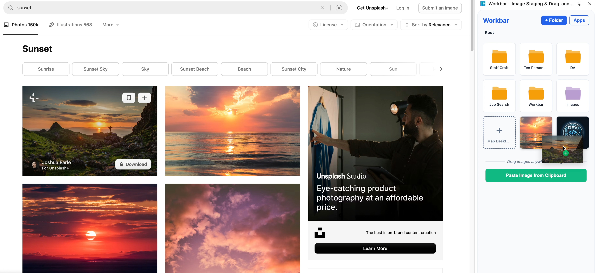
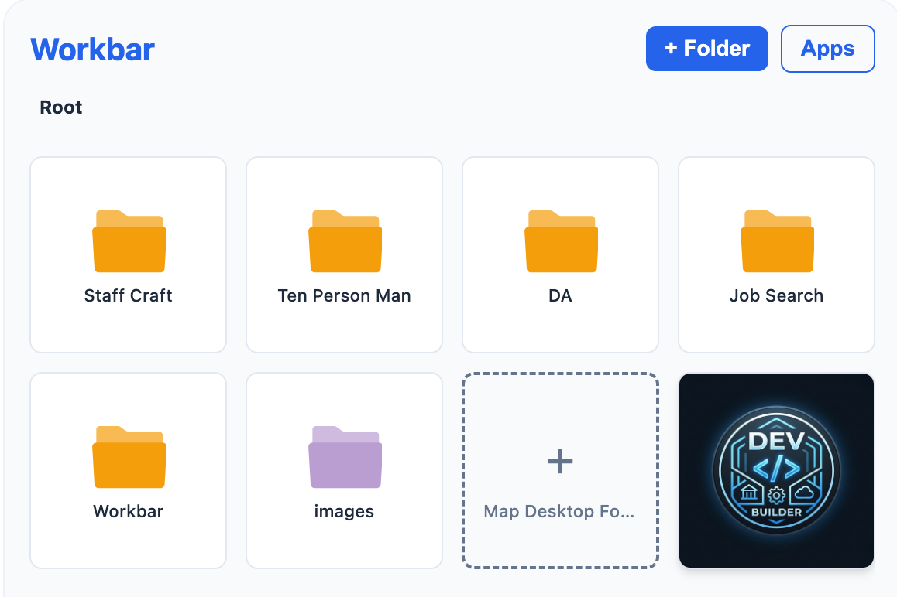
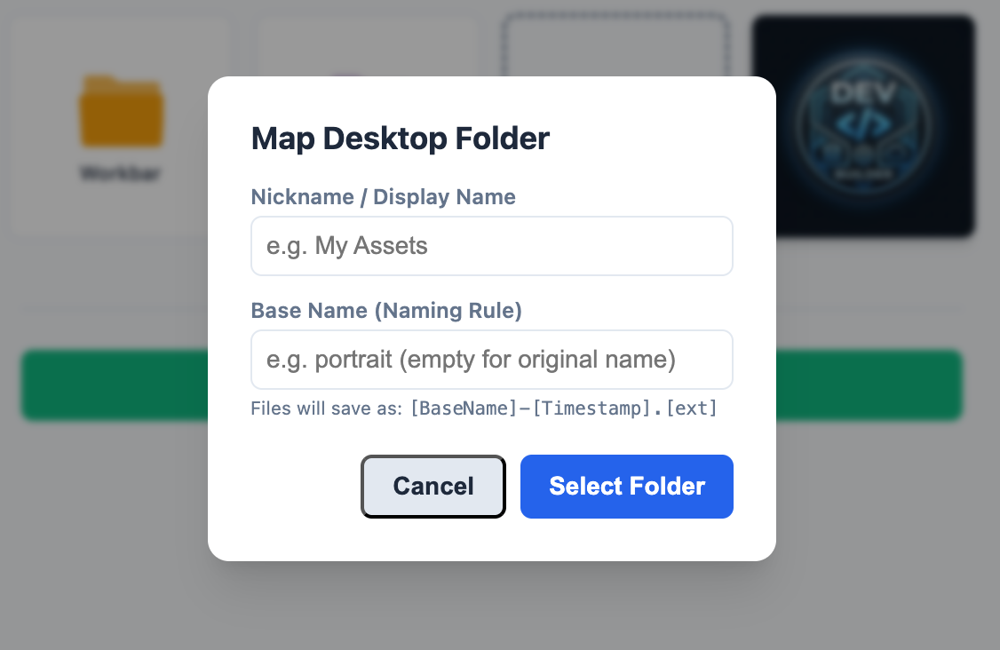

# Workbar 🚀

Your ultimate image staging area, right in your browser. Workbar is a powerful Chrome extension that simplifies your creative workflow by providing a dedicated space to stage, organize, and manage images with ease.

[](https://chromewebstore.google.com/detail/workbar/ehakbbljejpjiibnlkkedlicpkmjjgah)
[](https://opensource.org/licenses/MIT)

---

## 📺 Demo & Screenshots

### Demo Video
https://github.com/pheintzelman/workbar/raw/main/website/public/demo-video.mov

### Screenshots
| Side Panel View | Project Management | Virtual Folders |
| :---: | :---: | :---: |
|  |  |  |

---

## ✨ Features

- **🖼️ Image Staging Area:** Drag-and-drop or copy-paste images directly into the side panel for quick access.
- **📁 Project Organization:** Organize your staged images by projects to keep your creative assets structured.
- **📂 Virtual Folders:** Create virtual folders within projects for even more granular organization.
- **🔗 App Links:** Quick access to your favorite design and editing apps directly from the Workbar.
- **🌐 Site Awareness:** Intelligently auto-switches projects based on the active tab or domain you are browsing.
- **📥 Download Tracking:** Monitor and access your recent image downloads without leaving the side panel.

---

## 🛠️ Installation (Development)

To run Workbar locally for development:

1.  **Clone the repository:**
    ```bash
    git clone https://github.com/your-username/workbar.git
    cd workbar
    ```
2.  **Install dependencies:**
    ```bash
    npm install
    ```
3.  **Build the extension:**
    ```bash
    npm run build
    ```
4.  **Load into Chrome:**
    -   Open Chrome and navigate to `chrome://extensions/`.
    -   Enable **Developer mode** (toggle in the top-right corner).
    -   Click **Load unpacked**.
    -   Select the `workbar/dist` directory.

---

## 🚀 Tech Stack

-   **Frontend:** [React](https://reactjs.org/) + [TypeScript](https://www.typescriptlang.org/)
-   **Build Tool:** [Vite](https://vitejs.dev/)
-   **Extension Tooling:** [@crxjs/vite-plugin](https://crxjs.dev/)
-   **Styling:** CSS

---

## 📄 License

This project is licensed under the MIT License - see the [LICENSE](LICENSE) file for details.

---

*Made with ❤️ by [Your Name]*
